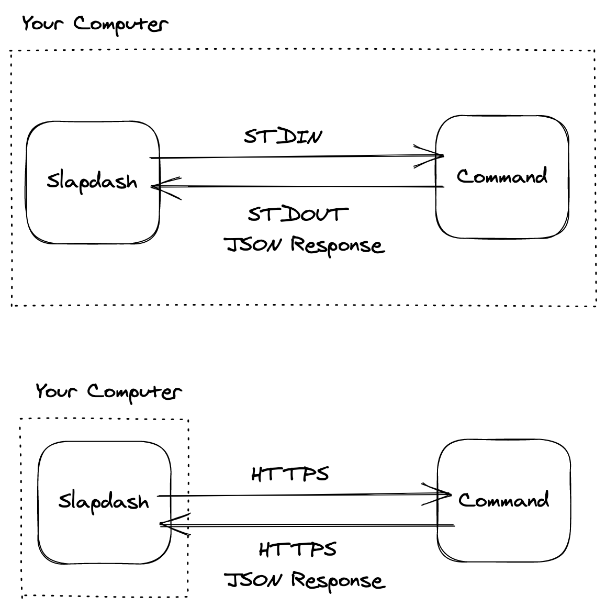

# Commands

The easiest way to think about commands is as functions. As a function, it can accept arguments as input and can return some output.

```
Command(Input) -> Output
```

Like a function, a command doesn't have to return anything. Imagine a command to put your computer to sleep: there is no output that's needed.\
\
However, most commands have an output, which tells Slapdash what to do or show in the Command Bar.\
\
This output is a JSON-serialized data structure that conforms to the [Command Response Specification](../reference/command-response.md).

You can use it to tell Slapdash to [copy something](../reference/command-response-action.md#actioncopy) to the clipboard, [open a URL](../reference/command-response-action.md#actionopenurl) in a browser, [show a form](../reference/command-response-view-form.md) to someone, or present an [interactive list view](../reference/command-response-view-list.md).

### Local vs. Cloud Commands

There are two types of commands: [Local Commands](local-commands.md), which are scripts that run on your computer, and [Cloud Commands](cloud-commands.md), which are commands that are hosted on the web.

They are mostly the same, but they do offer some trade-offs:

| Local Commands                    | Cloud Commands                    |
| --------------------------------- | --------------------------------- |
| Script on your computer           | Accessible by URL                 |
| Can do whatever your computer can | No direct access to your computer |
| Not shareable with team           | Shareable with team               |
| Great for development             | Great for production deployment   |
| Works offline                     | Unlimited compute                 |

When developing a new command, Local Commands are the fastest and simplest way to get things going.

### How Commands are Run

Local Commands are just scripts that are run on your computer. Slapdash uses stdin to send arguments to the command and interprets the stdout, expecting it to be a JSON [Command Response](../reference/command-response.md).\
\
Cloud Commands are run by making a request to an HTTPS endpoint. Slapdash passes arguments to the command using RESTful conventions. Slapdash interprets the HTTPS response, expecting it to be a JSON Command Response.


