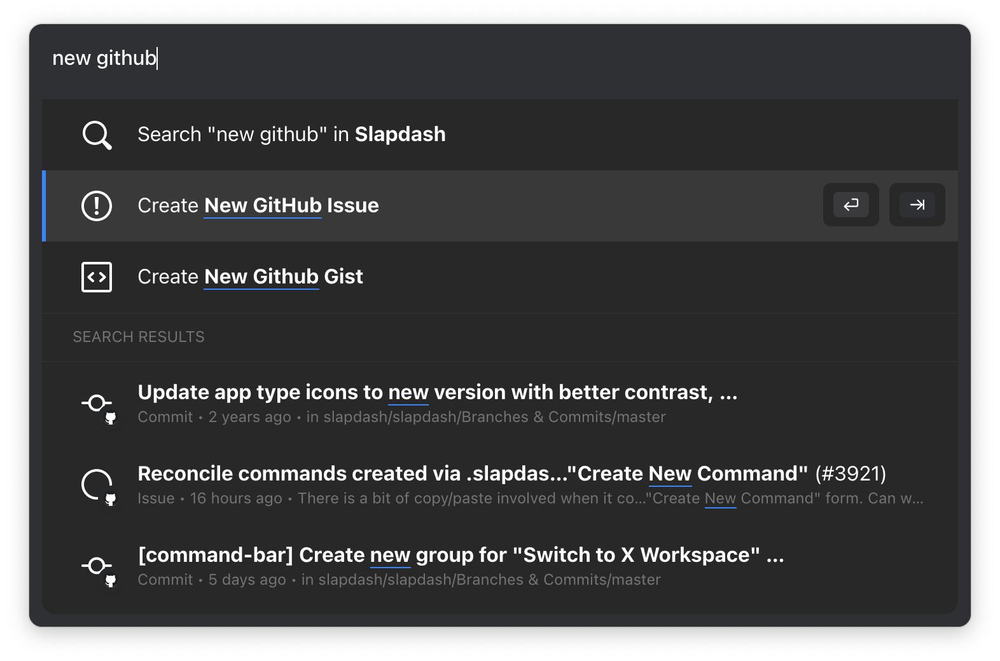
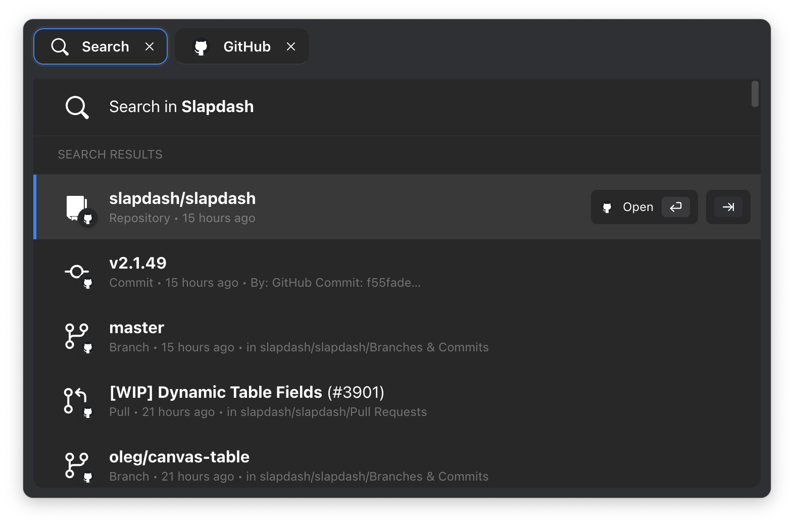
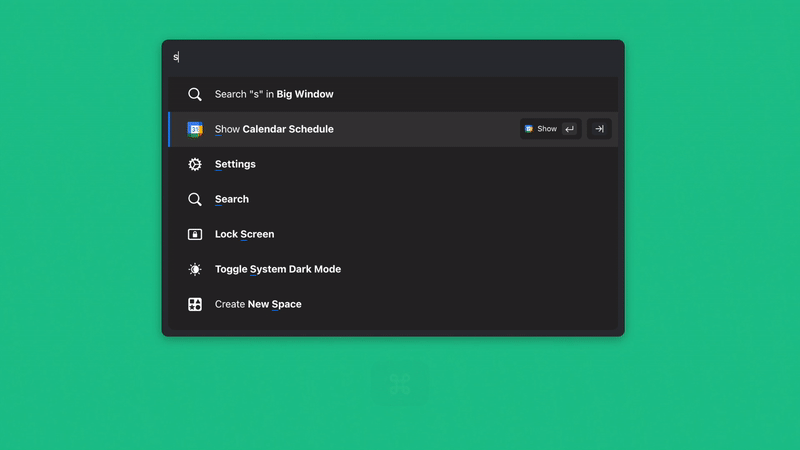

# How it Works

The Command Bar is a keyboard-centric interface for controlling your computer and cloud apps; with an emphasis on agency, speed and usability. The name is a combination of _command_ line and search _bar_. 

Like a command-line shell \(i.e. bash, zsh\), you can type your way to perform any task. Similarly, it’s also customizable and programmable.

At the same time, it's as easy to use as a search bar. You don't need to learn anything: just type what you want in the Command Bar as you would in Google.

## Opening the Command Bar

If you've ever used Mac's Spotlight feature, opening the Command Bar will be very familiar. It can be open from any application with one keyboard shortcut \(**`⌘ J`** is the default for Slapdash\). The Command Bar will appear on top of the application you are in. Clicking anywhere outside of it or hitting Esc will hide the Command Bar. To bring it back, just press the shortcut again.

## Doing Something

When the Command Bar is open, you interact with it by typing. As you type, the Command Bar will show you interactive options, narrowing them down as you type.

Hit **`Enter`** or click on an option to do something. Hitting **`Enter`** on a search result will open it. Hitting **`Enter`** on a command will run it.

More precisely, hitting **`Enter`** runs the **Action** associated with the selected option. Every option will always have an Action.

## Moving Somewhere

If you can open the Command Bar, type something and hit **`Enter`**, that's all you really need to know.

However, there is one more important dimension to the Command Bar: _location_.

Like a web page, the Command Bar has an address it's open to. And you can move to a different location by hitting **`Tab`**. It allows you to continue the experience in the Command Bar: like clicking a link to a different part of the app.

Hitting **`Tab`** on a search result will give you new options like **Copy URL** or **Add to Space**, for example.

The Location is visualized with pill-like tokens in the input of the Command Bar. If this was a URL, the path equivalent to the screenshot below would be: `/search?filter=github`

## Putting it Together

In the below demonstration, the Command Bar is opened and "show" is typed into the input.

The Command Bar view displays **Show Calendar Schedule** as one of the available options and selects it as the best match.

Hitting **`Enter`** moves the Command Bar to the **Show Calendar Schedule** command's location. Here, **`Tab`** would have gotten you to same place.

With the movement, the Command Bar now shows a "Show Calendar Schedule" token, which means you are running the "Show Calendar Schedule" command. The command shows your upcoming meetings as options.

Hitting **`Tab`** on an event \(one of the options\) moves to a new location in the Command Bar that shows event details.

**`Shift+Tab`** reverses the movement and brings you back to the list of events.

Hitting **`Enter`** on the event option runs the **Action**, which in this case is to open the Zoom app directly to the meeting video chat.

