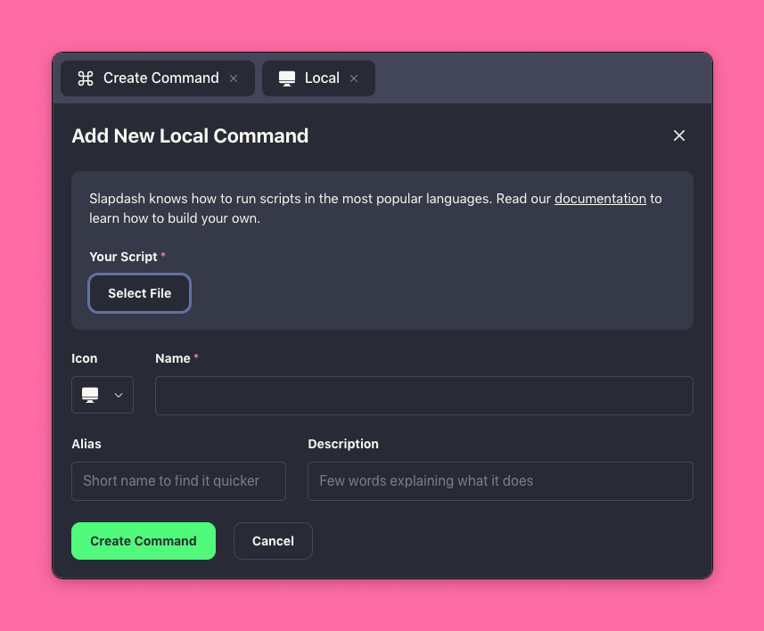

# Local Commands

Local commands are just scripts that run on your computer. Slapdash knows how to run scripts in the most popular languages.

Even if Slapdash doesn't support your language out of the box, you can just use shebang syntax, or create a bash wrapper to call into your program.

## Create Local Command

To create a local command, run **Create Command** in the Command Bar, choose **Local Script** as a type, select the script file on your computer, give your command a name and press **Create Command**.



## Language Support

We try to support as many languages as possible. Below you'll find a list of languages you can use to build Slapdash commands.

In practice, you can use a shebang directive to point to an interpreter of your choice.

* AppleScript
* bash / zsh
* JavaScript
* Perl
* PowerShell
* Python
* Ruby
* PHP
* TypeScript

### AppleScript

Support for AppleScript is baked into Mac OS. Just create a `my-command.applescript` file anywhere and start experimenting!

Here's an example of an AppleScript command which [toggles the Mac OS system dark mode](../command-tutorials/toggle-dark-mode.md).

```
#!/usr/bin/osascript

tell application "System Events"
  tell appearance preferences
    set dark mode to not dark mode
  end tell
end tell
```

### JavaScript

Slapdash runs JavaScript commands via [NodeJS](https://nodejs.org).

```javascript
const response = {
  view: {
    type: "list",
    options: [
      {
        title: "Open Slapdash",
        action: {
          type: "open-url",
          url: "https://slapdash.com"
        }
      },
      {
        title: "Copy Heart Emoji",
        action: {
          type: "copy",
          value: "❤️"
        }
      }
    ]
  }
};

console.log(JSON.stringify(response));
```

### TypeScript

Slapdash runs TypeScript commands via [NodeJS](https://nodejs.org) and [ts-node](https://www.npmjs.com/package/ts-node) TypeScript utility.

If you are developing your command inside a package, Slapdash will also look inside `node_modules` for the `ts-node` executable.

```typescript
const response = {
  view: {
    type: "list",
    options: [
      {
        title: "Open Slapdash",
        action: {
          type: "open-url",
          url: "https://slapdash.com",
        },
      },
      {
        title: "Copy Heart Emoji",
        action: {
          type: "copy",
          value: "❤️",
        },
      },
    ],
  },
};

console.log(JSON.stringify(response));
```

### Bash

You already have [bash](https://en.wikipedia.org/wiki/Bash\_\(Unix\_shell\)) (or [zsh](https://en.wikipedia.org/wiki/Z\_shell)) on your Mac. No need to install anything. Just create e.g. `my-command.sh` file anywhere and start bashing:

```bash
#!/bin/bash

echo '{
  "view": {
    "type": "list",
    "options": [
      {
        "title": "Open Slapdash",
        "action": {
          "type": "open-url",
          "url": "https://slapdash.com"
        }
      },
      {
        "title": "Copy Heart Emoji",
        "action": {
          "type": "copy",
          "value": "❤️"
        }
      }
    ]
  }
}'
```

### Python

macOS has both Python v2 and Python v3 pre-installed, so you can just use it by default. Put the following to e.g. `my-command.py`:

```python
#!python3
# -*- coding: utf-8 -*-
import json

print(json.dumps({
    "view": {
      "type": "list",
      "options": [
          {
              "title": "Open Slapdash",
              "action": {
                  "type": "open-url",
                  "url": "https://slapdash.com"
              }
          },
          {
              "title": "Copy Heart Emoji",
              "action": {
                  "type": "copy",
                  "value": "❤️"
              }
          }
      ]
      }
}))
```

You can use Python v2 too: just change the [shebang line](https://en.wikipedia.org/wiki/Shebang\_\(Unix\)) to `#!python2` as usual.

### Ruby

macOS should have Ruby pre-installed (or you can install it with `brew install ruby`). Put the following to e.g. `my-command.rb`:

```ruby
#!/usr/bin/env ruby
require 'json'

print JSON.generate({
  "view": {
    "type": "list",
    "options": [
      {
        "title": "Open Slapdash",
        "action": {
          "type": "open-url",
          "url": "https://slapdash.com"
        }
      },
      {
        "title": "Copy Heart Emoji",
        "action": {
          "type": "copy",
          "value": "❤️"
        }
      }
    ]
  }
})
```

### Perl

Perl is conveniently pre-installed on macOS. If you still remember how to write in Perl put the following to `my-command.pl`:

```perl
#!/usr/bin/perl -w
use utf8;
use JSON;

print encode_json({
  "view" => {
    "type" => "list",
    "options" => [
      {
        "title" => "Open Slapdash",
        "action" => {
          "type" => "open-url",
          "url" => "https://slapdash.com"
        }
      },
      {
        "title" => "Copy Heart Emoji",
        "action" => {
          "type" => "copy",
          "value" => "❤️"
        }
      }
    ]
  }
})
```

### PHP

Some version of PHP is pre-installed on macOS, so it should work out of the box. Put the following to e.g. `my-command.php`:

```php
#!php
<?php
echo json_encode([
  "view" => [
    "type" => "list",
    "options" => [
      [
        "title" => "Open Slapdash",
        "action" => [
          "type" => "open-url",
          "url" => "https://slapdash.com"
        ]
      ],
      [
        "title" => "Copy Heart Emoji",
        "action" => [
          "type" => "paste",
          "value" => "❤️"
        ]
      ]
    ]
  ]
]);
```

### PowerShell

[PowerShell](https://en.wikipedia.org/wiki/PowerShell) is already pre-installed on Windows. Just create a file with a `.ps1` extension. Here's an example that will empty your recycling bin.

```
Clear-RecycleBin -Force
```

## Locating Language Binaries

When searching for a programming language binary to execute the command script, we use the following approach:

First, we check the first line of the script, the same way it's done in Unix-like systems by looking for the shebang directive.

If the first line looks like `#!/path/to/binary` or just `#!binary`, Slapdash calls the referenced interpreter to execute the command.

If there is no shebang directive, Slapdash will try to infer the language binary from the file's extension. For example, if it's a `*.rb` file, Slapdash will try to find the installed Ruby to run the command.

When resolving relative binary paths, Slapdash will check the current directory's `node_modules/.bin` folder. This is a bit of sugar for the JavaScript ecosystem, letting Slapdash find tools like `ts-node` that could be installed locally to the javascript package of the command.

Finally, Slapdash will use the OS's `PATH` environment variable to resolve the binary.
